# Logistic Network Setup

This project is developed and tested on Linux 18.04 AWS t2.medium 40GB machine.

## Instructions to setup the hyperledger composer on the linux machine.

#### Pre-requisites

```
curl -O https://hyperledger.github.io/composer/latest/prereqs-ubuntu.sh
chmod u+x prereqs-ubuntu.sh
./prereqs-ubuntu.sh
```

### Install Composer Components

1. Essential CLI tools:

```
npm install -g composer-cli@0.20
```

2. Composer REST Server

```
npm install -g composer-rest-server@0.20
```

3. Install Composer Playground

```
npm install -g composer-playground@0.20
```

4. Install Hyperledger Fabric

```
mkdir ~/fabric-dev-servers && cd ~/fabric-dev-servers

curl -O https://raw.githubusercontent.com/hyperledger/composer-tools/master/packages/fabric-dev-servers/fabric-dev-servers.tar.gz
tar -xvf fabric-dev-servers.tar.gz
```

```
cd ~/fabric-dev-servers
export FABRIC_VERSION=hlfv12
./downloadFabric.sh
```

### Start the Network

1. Clean the network if it was running before:

```
cd ~/fabric-dev-servers
export FABRIC_VERSION=hlfv12
./stopFabric.sh
./teardownFabric.sh
./downloadFabric.sh
./startFabric.sh
```

2. Create Peer Admin Card

```
./createPeerAdminCard.sh
```

> All the screenshots of the below steps are attached in the bottom of this section.   
> Please refer them if you find any problem.  

3. Start Composer Playground

```
composer-playground
```

Open the composer playground in the browser.

Composer playground is started locally on the vm.

To access the playground on your web browser, instead of `http://localhost:8080`
Use `ipaddress_of_vm:8080`.

Deploy the `logistics-network.bna` in My Business Network not in the Web Browser.

Note down the admin.

Scroll down and select ID and Secret.

Username: `admin`  
Password: `adminpw`  

Now click Deploy  

4. Start Rest Server  
   Open a new terminal

```
composer-rest-server
```

enter the admin card: `admin@logistics-network`  

> :warning: Note: if you didn't note down it, open composer playground dashboard. The heading `admin@something` is the admin card name

enter "No" to everything except test explorer.

Now your `composer-rest-server` started.

### Configure the Client (Frontend)

Open `config.json` in the `src` folder.

Change the `serverURL` to the server address where composer-rest-server is running.

Change the `timeRaster` min interval. By default it is set to 10 (mins).

#### Install all the dependencies

Run `npm install` inside the client folder.

#### Start the Application

Run `npm run start`

Open the application on `localhost:3000`.

## Application Setup and Action Screenshot

It is assumed that you started the fabric successfully.

### Composer Playground

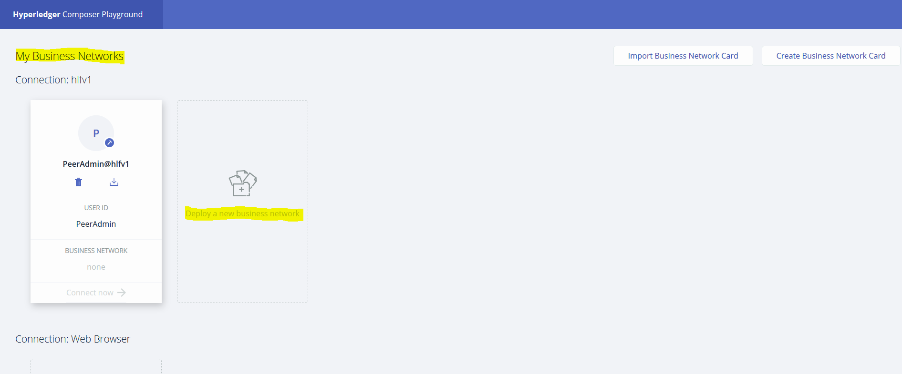

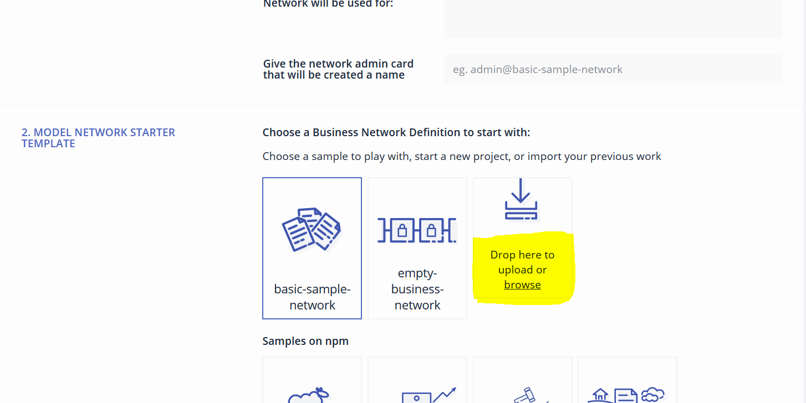

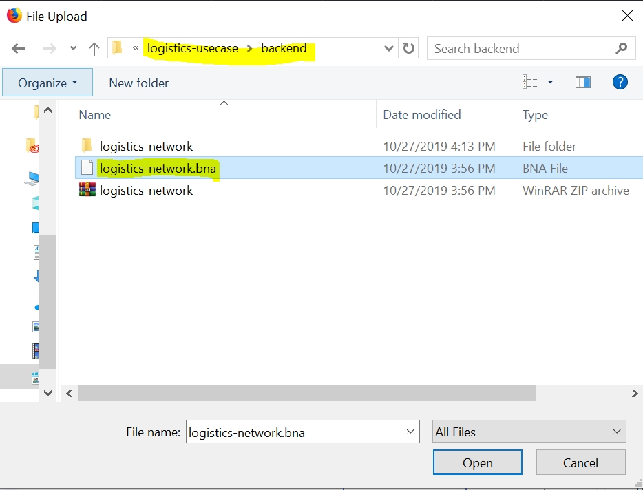

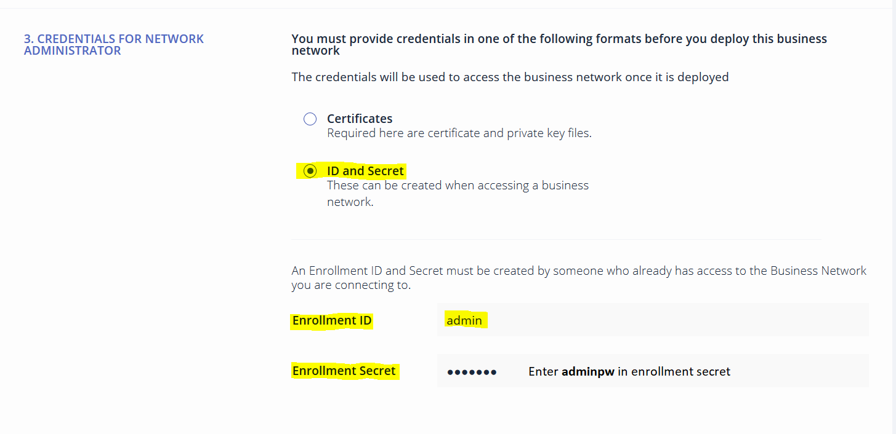

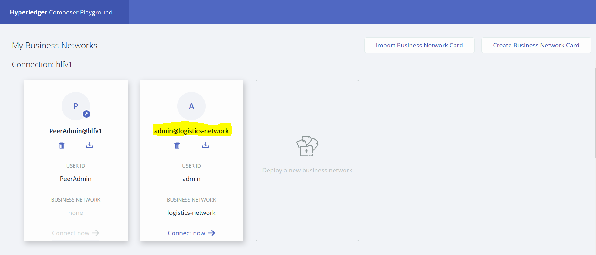

### Composer Rest Server

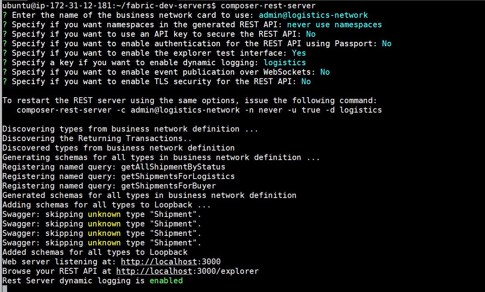

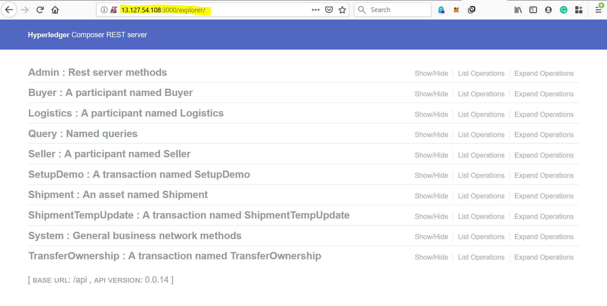

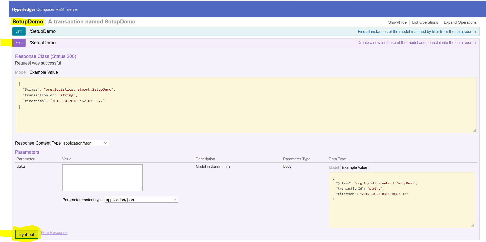

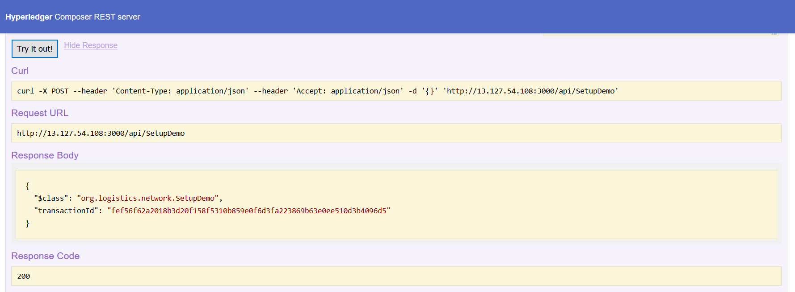

### Application Demo

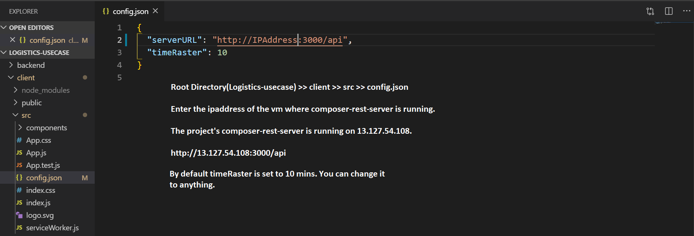

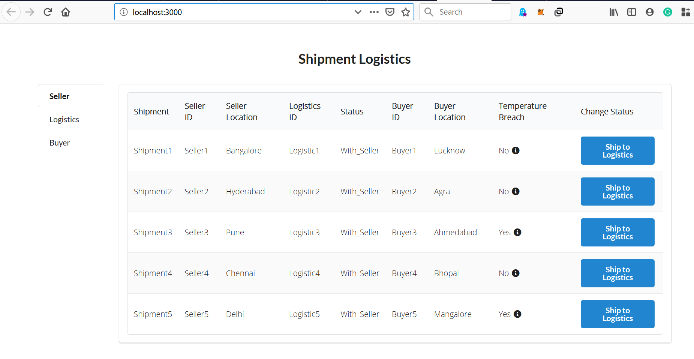

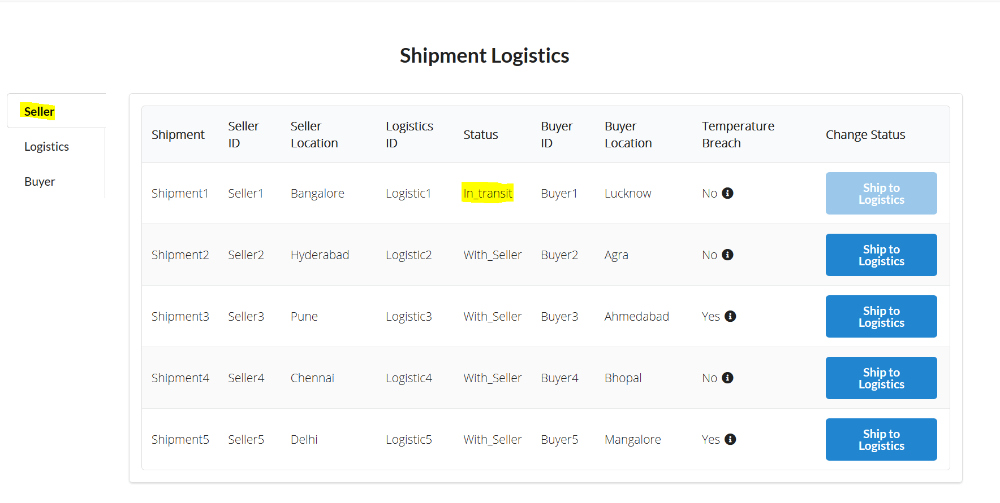

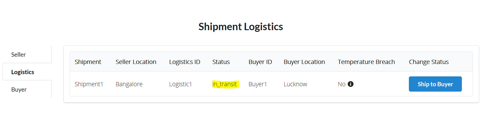

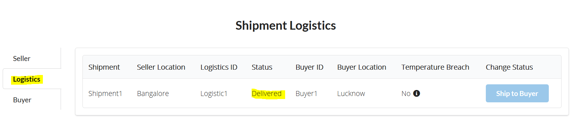


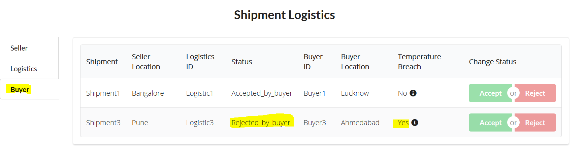

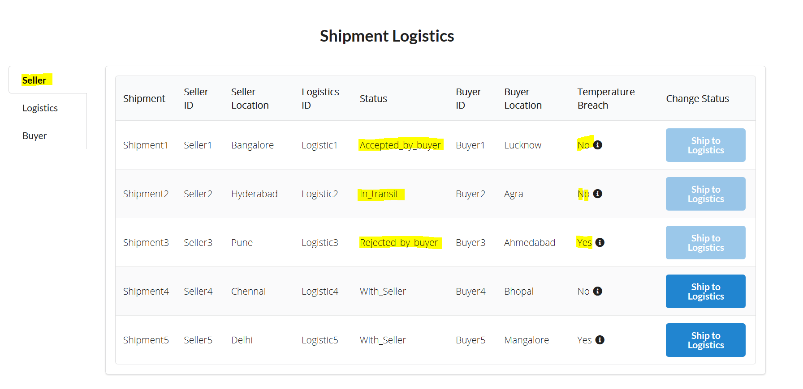
